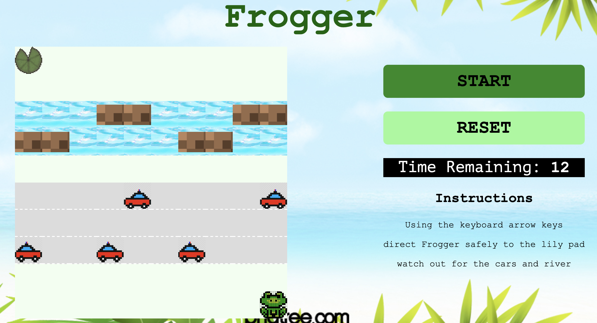
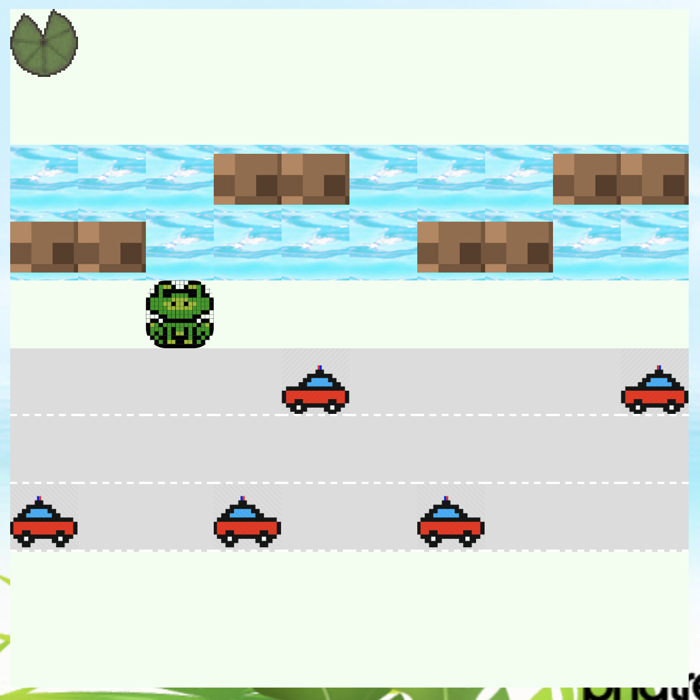

# GA Project 1 - Frogger

Based on the classic arcade game Frogger this is a browser game built with JavaScript, this was the first project I completed during the General Assembly Software Engineering Immersive (bootcamp) course.

## Resources

* Frogger arcade game [Youtube](https://www.youtube.com/watch?v=l9fO-YuWPSk)
* Frogger - [Wikipedia](https://en.wikipedia.org/wiki/Frogger)

## Built With

* HTML5 (including audio)
* CSS
* JavaScript
* Git / GitHub

## Timeframe

8 days

## Deployment

This game is deployed on [GitHub Pages](https://maryannetriggs.github.io/GA-project1-frogger/) - Turn up your volume!



---

## Getting Started

Use the clone button to download the game source code. Open the index.html file in your browser and the game will start. The images used in this game are stored in the 'images' folder and the audio files are stored in the 'audio' folder.

## To Play

The goal in Frogger is to get the frog safely to the lily pad on the other side of the game board. On her journey Frogger encounters numerous obstacles to overcome, namely crossing a busy road and fast-flowing river. 

The game is started by clicking on the start button, upon which the timer is initiated giving the player 12 second to reach the lily pad.

Frogger must be directed using the keyboard arrow keys across the road, avoiding the cars and then across the river, avoiding the strong currents by hopping from log to log. 

**The win conditions for Frogger are:**
- Getting Frogger to the lily pad

**The lose conditions for Frogger are:**
- Being hit by a car
- Falling into the river
- Being carried downstream on a log
- Running out of time

Once a win/lose condition has been met, the reset button may be pressed to play again.




---

## Game Architecture

The main challenge in writing the game logic was determining if one of the end conditions had been reached. This had to be evaluated in **two** locations. 

Note: Each element in the game (Frogger, cars, logs, lily pad) is a child element of the main grid (safespace, road, river).

**Firstly** in the frog movement logic, to determine if the cell Frogger was moving into creates a win/lose condition. 

1. If there weren't any other child elements this meant Frogger was either jumping into a safesapce or into the river.
- So next I checked the class of parent element.
  - If the parent element had a river class, Frogger dies and game over.
  - If the parent element did not have a class of river Frogger had landed on either road or into a safe space and so Frogger lives and game continues.

2. If there was another child element present this meant Frogger was jumping into a grid space with either a car, a log or the lily pad.
- So then I checked the class of first child element in that cell.
  - If the child element had a class of car, Frogger dies and game over.
  - If the child element had a class of lily, Frogger wins and game over.
  - If the child element has any other class, Frogger has landed on a log and the game continues.


```js
    const newPositionChildren = cells[newFrogPosition].children
    if (newPositionChildren.length === 0) {
      cells[newFrogPosition].appendChild(frog)                  
      if (cells[newFrogPosition].classList.contains('river1') || cells[newFrogPosition].classList.contains('river2')) {
        // GAME OVER - frog drowns in river
        gameEnding = 'lose'
        winOrLose(gameEnding)
      } else {
        frog.classList.add('animated', 'pulse')
        // GAME CONTINUES - frog is still safe
      }
    } else {
      const child = newPositionChildren[0]
      if (child.classList.contains('car') || child.classList.contains('car2')) {
        cells[newFrogPosition].appendChild(frog)
        // GAME OVER - frog has moved into path of car
        gameEnding = 'lose'
        winOrLose(gameEnding)
      } else {
        child.appendChild(frog)
        if (child.classList.contains('lily')) {
          // YOU WIN - frog has reached lilypad
          gameEnding = 'win'
          winOrLose(gameEnding)
        } else {
          frog.classList.add('animated', 'pulse')
          // GAME CONTINUES - frog is still safe
        }
      }
    }
```


**Secondly** in the setInterval timers controlling the movement of the car and log obstacles to determine if cell the obstacles were moving into would create a win/lose condition.
1. Car - when the car moves into a new position the code checks if there are any other child elements in the new position. If there is a child element the car has moved into the same cell as Frogger and the game is over.
```js
// Logic for movement of slow cars and their collision with Frogger
    slowItems = setInterval(() => {
      slowCars.forEach(car => {
        const roadPosition = road3.indexOf(car.parentElement) // direction of movement -> 
        road3[roadPosition].removeChild(car)
        if (roadPosition === road3.length - 1) { 
          road3[0].appendChild(car)
        } else {
          road3[roadPosition + 1].appendChild(car)
        }
        if (car.parentElement.childElementCount > 1) { 
          // GAME OVER - frog run over by car
          gameEnding = 'lose'
          winOrLose(gameEnding)
        }
      })
    }, 1000)
```
2. Log - regardless of whether Frogger is on the log, the log can move down the river until it reaches the limit of the game play area. When the log moves beyond the game play area, according to the rules of the game if Frogger is on the log, the game is over. As the code checks whether the log has reached the end of the river and to reset the log to the beginning of the river, it also checks for children of the log element (i.e. if Frogger is on the log). If Frogger is on the log, the game is over.
```js
// Logic for movement of logs
      slowLogs.forEach(log => {
        const riverPosition = river2.indexOf(log.parentElement) // move ->
        river2[riverPosition].removeChild(log)
        if (riverPosition === river2.length - 1) {
          river2[0].appendChild(log)
          if (log.childElementCount === 1) { // if the log has reached the edge of the board and there is a child element within it, the frog has gone overboard and game over
            // GAME OVER - frog washed away down the river
            frog.parentElement.removeChild(frog)
            gameEnding = 'lose'
            winOrLose(gameEnding)
          }
        } else {
          river2[riverPosition + 1].appendChild(log)
        }
      })
    }, 1000)
```


---

## Future Improvements

This project was personally quite challenging. Although the end game was quite simple, I believe the code to be robust. 

Advancements that could be made in the future to improve this game include:

- Mobile enabled
  - Size responsive
  - Mobile screen controls
- Auto-generation of game board with different sizes and difficulties
  - Including auto-generation and positioning of game obstacles (cars and logs)
  - With cars and logs of differing sizes/styles
- Multiple frogs and lilypads
- Inclusion of a high score board

## Author - Mary-Anne Triggs

Please visit my personal [portfolio](www.maryannetriggs.com)